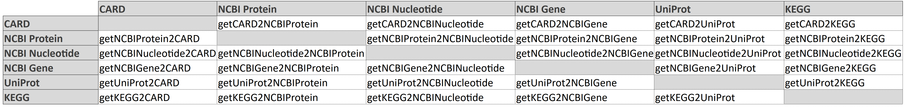

```{r setup, echo=FALSE}
knitr::opts_chunk$set(message=FALSE, fig.path='figures/', fig.align='center', 
                      class.output="bg-success")
cardPath = tempdir()
```

# Abstract

<p style="font-size:110%">
"ginmappeR" is an R package designed to provide functionalities to
translate gene or protein identifiers between state-of-art biological sequence
databases: CARD (<https://card.mcmaster.ca/>, [@alcock2023card]), NCBI
Protein, Nucleotide and Gene (<https://www.ncbi.nlm.nih.gov/>), UniProt
(<https://www.uniprot.org/>, [@uniprot2017uniprot]) and KEGG
(<https://www.kegg.jp>, [@kanehisa2000]). Also offers complementary
functionality like NCBI identical proteins or UniProt similar genes
clusters retrieval.<br><br>
</p>

# Introduction

<p style="font-size:110%">
Nowadays, biological sequence databases offer programmatic interfaces (API) to
access their data, like NCBI, UniProt or KEGG and, consequently,
community developed R packages to consume these services are available, such as 
rentrez [@winter2017rentrez], UniProt.ws [@carlson2016uniprot] and KEGGREST
[@tenenbaum2019keggrest], respectively. Other databases, like The
Comprehensive Antibiotic Resistance Database (CARD) offer their data as
a downloadable file.
<p>

<p style="font-size:110%">
The heterogeneity and low coupling of these tools motivated us to
conceive ginmappeR, an integral package that translates gene or protein
identifiers between the mentioned databases, making it easier for users
to work with multiple datasources in an unified and complete way.
<br><br>
</p>

# Software features

<p style="font-size:110%">
The gene/protein identifier translation feature is bidirectional in
every cited database and translates into a 6x6 matrix (see figure below)
of functions of the form `getSource2Target`. For example, to translate
from CARD to UniProt, `getCARD2UniProt` can be used.
</p>

<div style="width:800px; height:80px;padding-left:0px;">
<p style="padding-left:0px;text-align:center;">
{style="padding-left:0px"}
</p>
</div>

<p style="font-size:110%">
Additionally, features that were not available in their respective
packages like retrieval of UniProt similar genes clusters, or were not
easily accessible (such as NCBI identical proteins retrieval), are part of
ginmappeR id translation implementation and are also offered as
individual functions for the user: `getUniProtSimilarGenes` and
`getNCBIIdenticalProteins`.
</p>

<p style="font-size:110%">
Finally, as previously mentioned, considered databases offer API interfaces
and associated R packages, except for CARD, which is only available as a
downloadable zip file. To solve this, ginmappeR automatically downloads
CARD's latest version and also offers the user the possibility to update
it through the `updateCARDDataBase` function.
</p>

<br>

# Example

<p style="font-size:110%">
In order to illustrate the functionality of our package, we display some
id conversion examples, and later on, NCBI identical protein and UniProt
similar genes clusters examples.
</p>

## Identifier translation

<p style="font-size:110%">
Let us take CARD ARO identifier `3003955` and map it to the other
databases starting with the NCBI group, Protein, Nucleotide and Gene:
</p>

```{r}
library(ginmappeR)
getCARD2NCBIProtein('3003955')
getCARD2NCBINucleotide('3003955')
getCARD2NCBIGene('3003955')
```

<p style="font-size:110%">
Now, let's map the id to UniProt:
</p>

```{r}
getCARD2UniProt('3003955')
```

<p style="font-size:110%">
Finally, let's map the id to KEGG database:
</p>

```{r}
getCARD2KEGG('3003955')
```

<p style="font-size:110%">
Some of the mapping functions have parameters to obtain all possible
translations (`exhaustiveMapping`) or to detail the percentage of identity of
the source id with the obtained id (`detailedMapping`). More information on this
in the code's documentation. Let's see an example employing these parameters:
</p>

```{r}
# Note that when using exhaustiveMapping = TRUE, it returns a list instead
# of a character vector, to avoid mixing the result identifiers
getCARD2UniProt('3002372', exhaustiveMapping = TRUE, detailedMapping = TRUE)
```

<p style="font-size:110%">
All the functions in ginmappeR are vectorized, that is, they can map a vector of 
identifiers, for example:
</p>

```{r}
getCARD2NCBIProtein(c('3003955', 'wrong_id', '3002535'))
```

<br>

## NCBI identical protein retrieval

<p style="font-size:110%">
R package rentrez offers access to NCBI databases, among which is Identical 
Protein Groups. In order to make it more accessible to users, ginmappeR includes
`getNCBIIdenticalProteins` that receives a NCBI identifier and returns its
identical proteins in form of a list of identifiers:
</p>

```{r}
getNCBIIdenticalProteins('AHA80958')
```

<p style="font-size:110%">
Through `format` parameter, it is possible to obtain results in a dataframe:
</p>

<style>
table {margin-left:0px;}
</style>

<div style="padding-left:0px;">
<p style="padding-left:0px;text-align:center;">
```{r}
result <- getNCBIIdenticalProteins('AHA80958', format = 'dataframe')
knitr::kable(result)
```
</p>
</div>

## UniProt similar genes clusters

<p style="font-size:110%">
The function `getUniProtSimilarGenes` allows to retrieve clusters of genes with
100%, 90% or 50% identity with the provided identifier. Let us try with UniProt
gene `Q2A799` and 100% identity:
</p>

```{r}
getUniProtSimilarGenes('Q2A799', clusterIdentity = '1.0')
```

<p style="font-size:110%">
We can use argument `clusterNames` to also retrieve the clusters names:
</p>

```{r}
getUniProtSimilarGenes('Q2A799', clusterIdentity = '0.9')
```

<br>

# References
